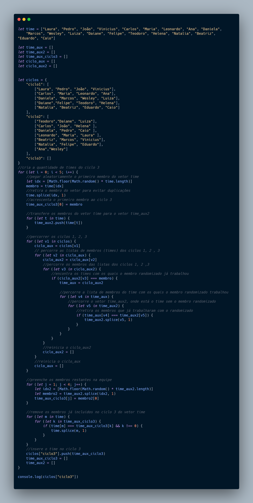

# TiMS - Team Management System

## Modelo de Solução para Problema com Divisão de Times

Proposta de solução em linguagem Javascript para gerar equipes , de modo que a maioria dos integrantes não tenham trabalhado juntos anteriormente.

O código cria o ciclo 3, pega aleatoriamente um membro do vetor que contem os integrantes do time, percorre as listas dos ciclos anteriores e vai incluindo os outros integrantes em seguida, ao finalizar a escolha das equipes inclui dentro ciclo 3 e depois no ambiente ciclos.

## Link de documentação do Projeto no Notion

## Imagem do código

## Implementações a serem feitas

- Interface com algum Framework Javascript.
- Melhorar a lógica de geração de equipes para
- Funções para adicionar , deletar, editar.
